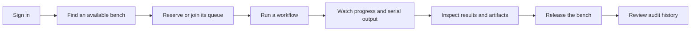
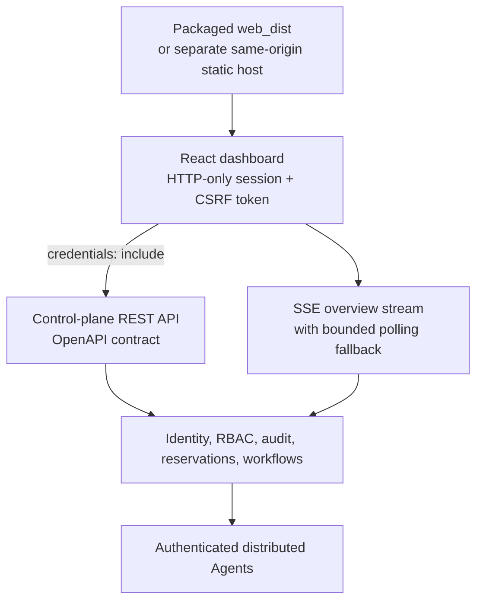

# Phase 7 — web dashboard and operations UX

Phase 7 introduces the browser operating surface in the **0.8.0-alpha** release. It is a React and
TypeScript single-page application backed by the existing FastAPI control plane. The server stays
authoritative for identity, access, reservations, queues, workflow execution, distributed state,
artifacts, and audit history; the browser does not recreate those rules.

## Release cut line

The supported browser journey is:

The application also exposes Agent and CI-session inspection plus permission-gated organisation,
user, team, service-account, role, policy, and audit administration. Advanced analytics, visual
workflow authoring, billing, broad custom branding, and a plugin marketplace remain out of scope.

## Required view map

The specification's required screen documentation is mapped directly to implemented routes below.
The linked document contains a compact wireframe for every row, including information hierarchy,
primary controls, status text, and supporting detail.

| Required view | Route | Diagram |
| --- | --- | --- |
| Overview | `/` | [Overview wireframe](WEB_DASHBOARD.md#overview) |
| Bench inventory | `/benches` | [Inventory wireframe](WEB_DASHBOARD.md#bench-inventory) |
| Bench detail | `/benches/:id` | [Bench-detail wireframe](WEB_DASHBOARD.md#bench-detail) |
| Workflow run | `/workflow-runs/:id` | [Run wireframe](WEB_DASHBOARD.md#workflow-run) |
| Agent detail | `/agents/:id` | [Agent wireframe](WEB_DASHBOARD.md#agent-detail) |
| User administration | `/admin/users` | [User-admin wireframe](WEB_DASHBOARD.md#user-administration) |
| Audit log | `/audit` | [Audit wireframe](WEB_DASHBOARD.md#audit-log) |

## Architecture

The TypeScript API surface is generated from `docs/control-plane-openapi.json`. CI verifies the
checked schema, generated client, frontend compile, tests, production bundle, dependency audit,
and the packaged wheel. Presentation-oriented endpoints add overview aggregation, resource
permissions, workflow-run summaries, bench timelines, queues, bounded serial windows, and live
invalidation without introducing browser-only business logic.

## Distributed-state semantics

`UNKNOWN`, `RECONCILING`, `OFFLINE`, and stale inventory are displayed as uncertainty, never as
success or failure. Live event loss changes the connection indicator to reconnecting or polling;
it does not change the last server-reported operation state. Serial output is cursor-paged and the
browser keeps a bounded text buffer.

An existing active reservation can be reused when launching a workflow. The request explicitly
chooses whether terminal or pre-dispatch cleanup releases that reservation. Queue entry ownership,
reservation ownership, and all resource access remain server enforced.

## Security boundary

- Local and OIDC browser sign-in issue a short-lived `HttpOnly` session cookie rather than exposing
  an access token to JavaScript.
- Cookie-authenticated mutations require the matching `X-CSRF-Token` double-submit value.
- An explicit bearer credential takes precedence and preserves native CLI/CI compatibility.
- The integrated server publishes a restrictive content security policy, clickjacking protection,
  no-sniff and no-referrer headers, safe cache rules, and no source-map downloads.
- Logs are inserted as text; the application has no unsafe HTML rendering path.
- Firmware limits are validated in the UI for feedback and by the server for enforcement.
- The browser never receives server filesystem paths or plaintext credentials after their one-time
  creation response.

See [web authentication](WEB_AUTHENTICATION.md), [permissions](WEB_PERMISSIONS.md), and the
[Phase 6 security model](SECURITY_MODEL.md) for the complete trust boundary.

## Deployment and compatibility

Integrated deployment is canonical: the Python wheel contains the fingerprinted Vite bundle and
the control plane serves it at `/`. A separately operated static server is also supported when it
keeps the browser same-origin and reverse-proxies `/api/v1` to the control plane. Arbitrary
cross-origin cookie authentication is intentionally not enabled.

The API and CLI remain first-class interfaces. A deployment can leave `web.enabled: false` and use
the complete non-browser surface unchanged. See [web deployment](WEB_DEPLOYMENT.md).

## Verification and known alpha limits

Normal validation is hardware-free and uses SimLab. Backend tests cover browser cookie/CSRF/OIDC
behavior, static serving, queues, workflow reservation reuse, presentation APIs, and distributed
state. Frontend tests cover utilities, permission rendering, forms, tables, dialogs, error mapping,
bounded logs, logout, and terminal session expiry. The fixture Playwright suite checks deterministic
same-origin browser behavior. The real suite starts a fresh control plane, two authenticated SimLab
Agents and two benches, then exercises the serial Administrator → Operator → Viewer → Lab Admin →
audit flow required by the cut line. The release pipeline performs frontend and Python quality
checks, runs both browser suites, validates both OpenAPI files, builds the dashboard, and inspects
the wheel contents.

This remains a self-hosted alpha and not a hardened public-SaaS edge. Distinct-origin browser
hosting, high availability, external telemetry, enterprise federation/provisioning, broad rate
limiting, and production proxy policy need an explicit deployment design. The event stream is an
invalidation/snapshot channel rather than a durable event log; clients refetch authoritative REST
resources after reconnection.

The generated `openapi-fetch` client is the default transport across the Phase 7 cut line:
browser authentication, overview aggregation, bench and Agent inventory, Agent actions, workflows
and results, CI sessions, artifacts, audit queries, and identity/access administration. Its
schema-derived request types cover static and dynamic paths, filters, pagination, and mutation
bodies while the common fetch layer retains cookie credentials, CSRF protection, session refresh,
and structured errors. Intentionally open response maps are normalized at the presentation
boundary; the generic transport remains only as a compatibility escape hatch for endpoints whose
response contracts still need to be tightened.

## Documentation map

- [Dashboard routes and screen diagrams](WEB_DASHBOARD.md)
- [Integrated and separate-static deployment](WEB_DEPLOYMENT.md)
- [Browser authentication](WEB_AUTHENTICATION.md)
- [Permission-aware navigation and actions](WEB_PERMISSIONS.md)
- [SSE, polling, and stale state](LIVE_UPDATES.md)
- [Troubleshooting](WEB_TROUBLESHOOTING.md)
- [Accessibility](WEB_ACCESSIBILITY.md)
- [Complete SimLab browser demonstration](PHASE_7_BROWSER_DEMO.md)
